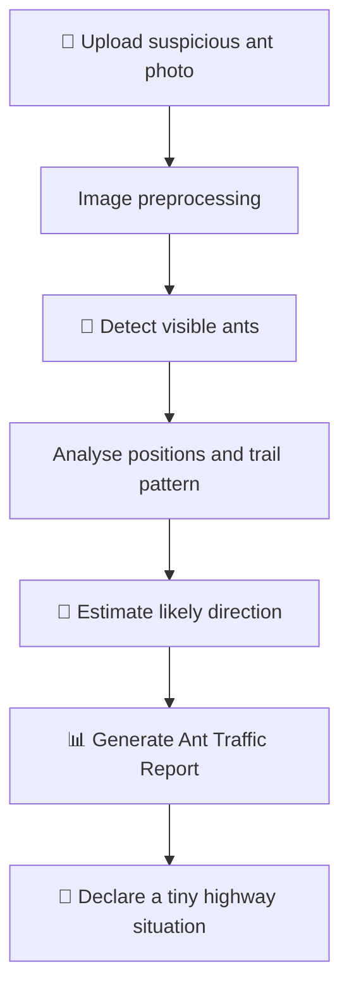

# Ant Trail Tracker 🐜

 **Because ants have places to be.**

 ### 🚀 Live Demo

[View the live website →](https://useless-project-temp-rose.vercel.app/)

## Basic Details

### Team Name: WaterFalls

### Team Members

- Team Lead: Annette Ann Varghese - Baselios Mathews II Engineering College , Sasthancotta , Kollam .
- Member 2: Annette Ann Varghese  - Baselios Mathews II Engineering College, Sasthancotta , Kollam .
- Member 3: Aarsha Raj S - Baselios Mathews II Engineering College, Sasthancotta , Kollam .

### Project Description

Ant Trail Tracker is an unnecessarily serious image-analysis prototype that investigates suspicious ant activity from an uploaded photo. It detects visible ants, estimates a likely trail direction, and creates an official-looking Ant Traffic Report for a problem that was doing just fine without us.

### The Problem (that doesn't exist)

Ants walk around with zero public accountability. Nobody knows where they are going, whether they are late, or who approved their tiny highways. This has gone on for far too long.

### The Solution (that nobody asked for)

Upload a photo and let Ant Trail Tracker launch a full-scale investigation. It identifies ant-like objects, infers the probable direction of the trail, draws visual overlays, and reports critical findings such as **ANT ARMY SIZE**, **TRAFFIC JAM: CONFIRMED**, and **SUSPICIOUS INDIVIDUAL DETECTED**.

Please do not disturb the ants. They are probably late for something.

### Technologies/Components Used

For Software:

- **Languages:** [Example: JavaScript, Python]
- **Frontend:** [Example: HTML, CSS, JavaScript / React]
- **Backend:** [Example: Python Flask / Node.js Express]
- **Image Processing / AI:** [Example: OpenCV / YOLO / custom detection logic]
- **Database:** [If used, add it here; otherwise write “Not required”]
- **Tools:** [Example: Git, GitHub, VS Code]
- **Browser Requirement:** A modern browser such as Google Chrome, Microsoft Edge, or Firefox
- **Local Server:** The prototype runs locally at `http://localhost:8000`
- **Input Requirement:** A clear image containing visible ants

For Hardware:

- No dedicated hardware is required.
- A computer and a suspicious ant photograph are enough.

### Implementation

For Software:

#### Installation

```bash
git clone <your-repository-url>
cd <your-project-folder>

<your install command>
```

#### Run

```bash
<your start command>
```

Open (useless-project-temp-rose.vercel.app) to begin the investigation.

## Project Documentation

For Software:

### Screenshots


*The Ant Trail Tracker home screen: a highly official portal for uploading evidence of suspicious ant activity.*


*The investigation in progress, with essential scientific procedures such as “Counting tiny legs…” and “Consulting senior ants…”.*


*The completed Ant Traffic Report, showing detected ants, an inferred trail, direction, and traffic-level findings.*

### Diagrams



*Workflow: the image is analysed for ant-like objects and trail patterns, then turned into a disproportionately official traffic report.*

For Hardware:

No hardware build, circuit, schematic, or component photos apply to this software project.

### Project Demo

#### Video

[Add your demo video link here]

*The demo should show uploading an ant image, the funny analysis/loading experience, and the final trail and traffic report.*

#### Additional Demos

- [Add deployed project link here]
- [Add GitHub repository link here]
- [Add presentation link here]

## Limitations

- **A single image cannot reliably determine true speed.** Video or multiple time-stamped frames are needed for meaningful speed estimates.
- **Direction is an inference.** A photo may suggest a shared path but cannot prove where each ant came from or where it will go next.
- Tiny, blurred, overlapping, hidden, or low-contrast ants can be difficult to detect.
- Shadows, crumbs, and pixels with ambitions may be mistaken for ants.
- The project analyses image patterns, not ant intentions, colony politics, or snack destinations.

## Future Improvements

- Add video and multi-frame tracking for real direction and speed estimates
- Improve detection under different lighting conditions and ant sizes
- Add an ant-congestion heatmap and live trail map
- Add dramatic traffic-control audio
- Add an “Interrogate the Ants” button

## Team Contributions

- Annette Ann Varghese: Developed the Ant Trail Tracker interface, upload flow, and playful Ant Traffic Report design.
- Aarsha Raj S: Built the ant image-analysis logic, trail-direction detection, and result visualization.

---

Made with ❤️ at TinkerHub Useless Projects


