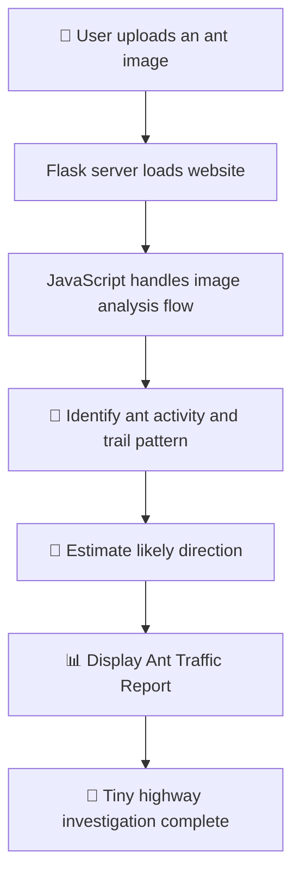

# Ant Trail Tracker 🐜

> **Because ants have places to be.**

## Basic Details

### Team Name: WaterFalls

### Team Members

- Team Lead: [ Annette Ann Varghese] - [ Baselios mathews II  colleage of engineering  ]
- Member 2: [Aarsha Raj S] - [Baselios mathews II  colleage of engineering ] 

### Project Description

Ant Trail Tracker is a fun web application that investigates suspicious ant activity from an uploaded image. It analyses the image, identifies visible ants, estimates their likely trail direction, and presents the result as a dramatic **Ant Traffic Report**.

### The Problem (that doesn't exist)

Ants walk around every day without telling anyone where they are going. Nobody knows whether they are late, following traffic rules, or creating unauthorized tiny highways.

This level of ant-related uncertainty is unacceptable.

### The Solution (that nobody asked for)

Ant Trail Tracker allows users to upload an image containing ants and launches an unnecessarily serious investigation. The application analyses the image, estimates a possible ant trail, and gives amusing results such as:

- **ANT ARMY SIZE**
- **WHERE ARE THEY GOING?**
- **TRAFFIC JAM: CONFIRMED**
- **SUSPICIOUS INDIVIDUAL DETECTED**

Please do not disturb the ants. They are probably late for something.

## Technical Details

### Technologies/Components Used

For Software:

- **Languages:** Python, HTML, CSS, JavaScript
- **Frontend:** HTML for structure, CSS for styling, and JavaScript for interactions, image upload handling, and result visualisation
- **Backend:** Flask web server written in Python
- **Environment:** Python virtual environment (`venv`)
- **Main Files:**
  - `app.py` — Flask application server
  - `index.html` — Main webpage and user interface
  - `style.css` — Design, layout, animations, and funny visual styling
  - `script.js` — Image upload flow, analysis behaviour, animations, and result display
- **Database:** Not required
- **Development Tools:** Python, Flask, Visual Studio Code, Git, GitHub
- **Browser Requirement:** Google Chrome, Microsoft Edge, Firefox, or another modern browser
- **Local Server:** Runs at `http://localhost:8000`
- **Input Requirement:** A clear image containing visible ants

For Hardware:

- No dedicated hardware is required.
- A computer and an image containing suspicious ant activity are enough.

### Implementation

For Software:

#### Installation

```powershell
cd "C:\Users\annet\Documents\USELESS HACKTON"
.\venv\Scripts\Activate.ps1
pip install flask
```

#### Run

```powershell
python app.py
```

Open [http://localhost:8000](http://localhost:8000) in a browser.

## Project Documentation

For Software:

### Screenshots


*The home screen of Ant Trail Tracker, where users can begin a high-priority investigation into suspicious ant activity.*


*The analysis screen shows funny loading messages such as “Counting tiny legs...” and “Consulting senior ants...”.*


*The final Ant Traffic Report displays detected ants, estimated trail direction, traffic status, and highly unnecessary official findings.*

### Diagrams



*Workflow: the user uploads an image, the application processes the ant activity, and the result is displayed as a playful traffic report.*

For Hardware:

No circuits, schematics, or hardware components are required because Ant Trail Tracker is a software-only project.

### Project Demo

#### Video

Run the project locally using Flask and open:

[http://localhost:8000](http://localhost:8000)

*The demo shows an ant image being uploaded, humorous analysis messages appearing, and a final Ant Traffic Report being generated.*

#### Additional Demos

- **Local Demo:** `http://localhost:8000`
- **Source Code:** [Add GitHub repository link here]
- **Demo Video:** [Add YouTube, Google Drive, or Instagram link here]

## Limitations

- **A single image cannot reliably determine true ant speed.** Speed requires video or several time-stamped frames.
- **Trail direction is an estimate.** A still image cannot prove exactly where each ant came from or where it will go next.
- Tiny, blurry, overlapping, hidden, or low-contrast ants may be difficult to identify.
- Shadows, crumbs, and random dark pixels may occasionally look suspiciously ant-like.
- The project cannot determine ant motives, colony politics, or snack destinations.

## Future Improvements

- Add video and multi-frame analysis for more accurate movement and speed tracking
- Improve ant detection in different lighting conditions and backgrounds
- Track individual ants across video frames
- Add a live ant-congestion heatmap
- Add sound effects for critical ant traffic alerts
- Add an **“Interrogate the Ants”** button
- Add a leaderboard for the busiest tiny highways

## Team Contributions

- [Annette Ann Varghese]: Built the Flask backend, project setup, and local server configuration,the JavaScript interactions, image-upload flow, analysis animations, and Ant Traffic Report display.


- [Aarsha Rah S]: Developed the HTML, CSS, user interface, styling, and funny visual design.


---

Made with ❤️ at TinkerHub Useless Projects


